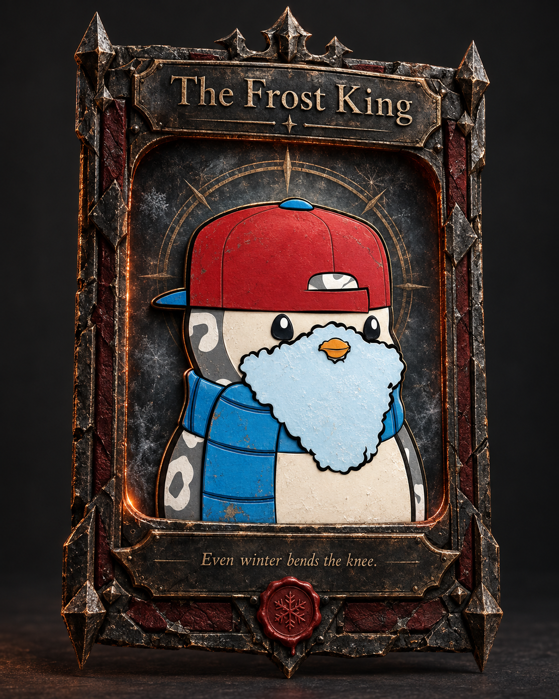
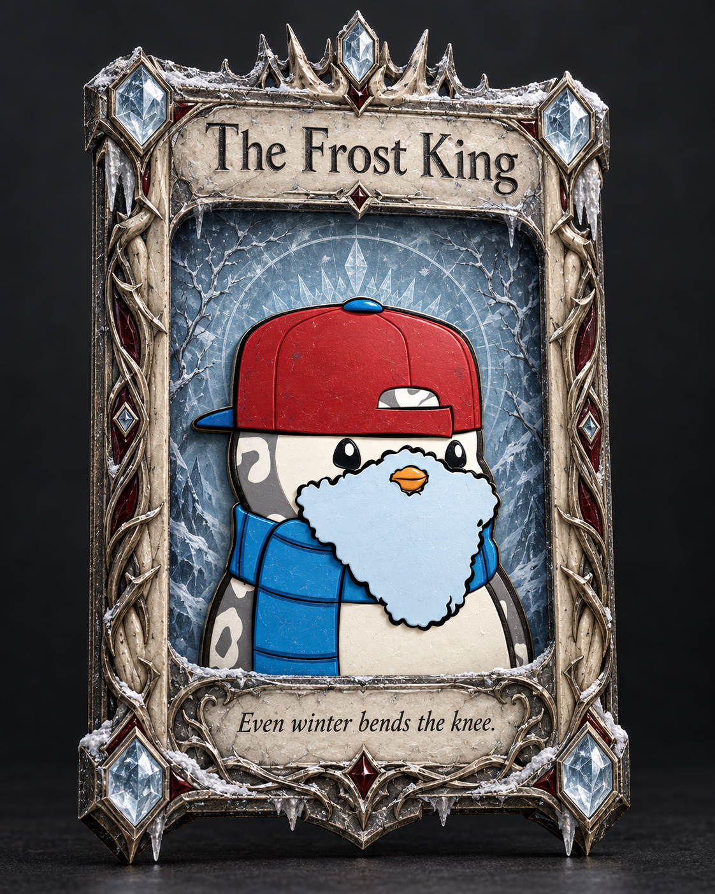
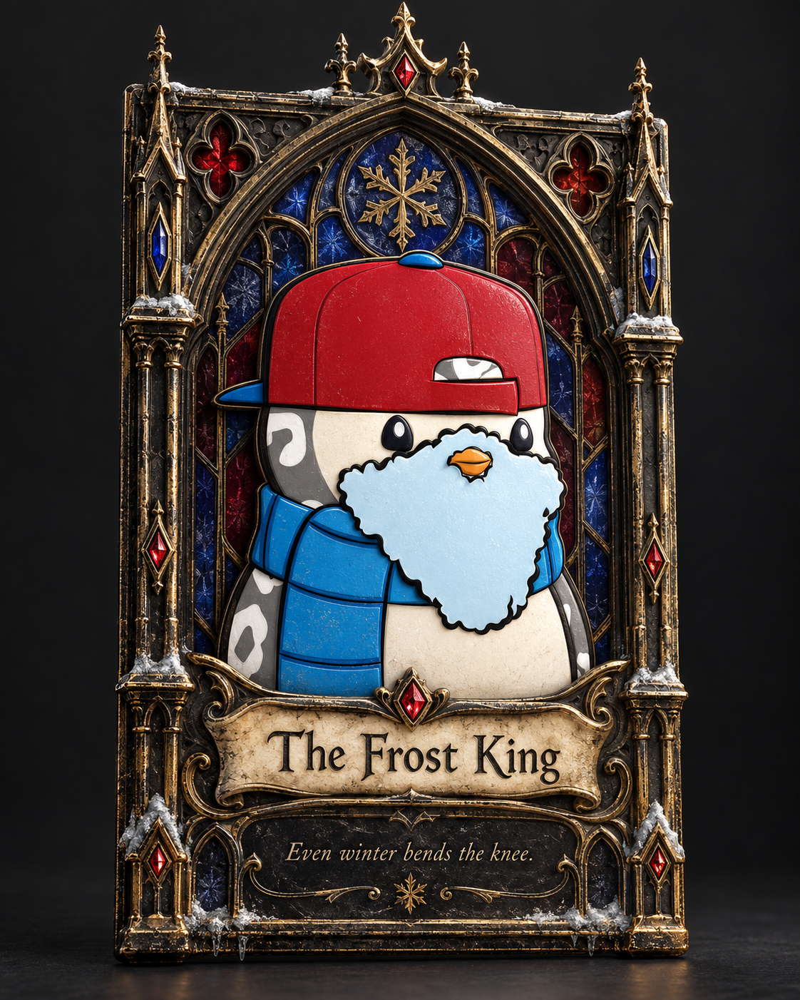
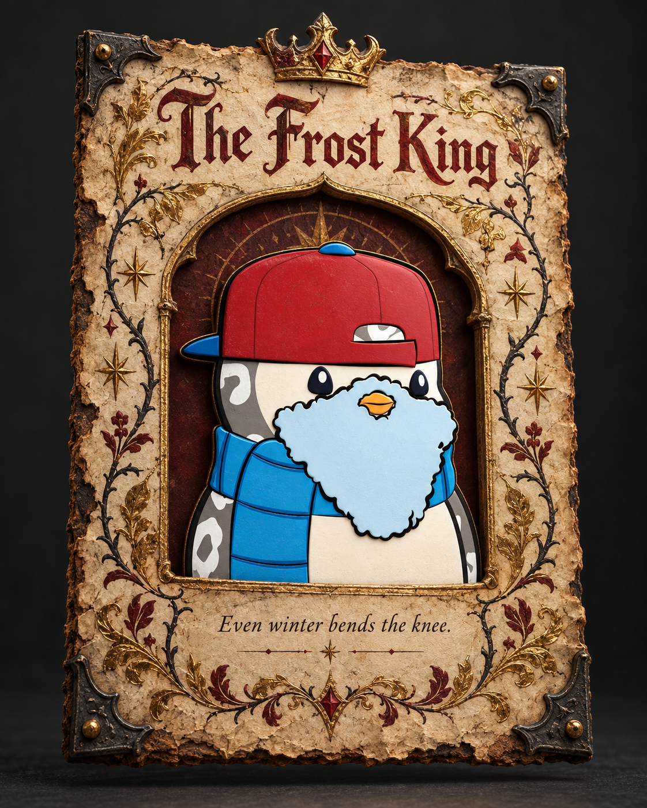
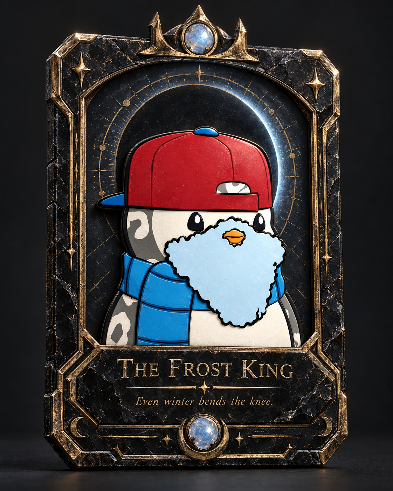

# Frost King — five visual concepts

Generated with the built-in image_gen tool on 2026-09-28. These are visual concept options for selection; the interactive card remains unchanged.

Inputs: supplied penguin illustration (subject reference), existing relic-card render (depth reference). Preserve the cap/beard relief and original character when implementing the selected direction.

## 01. Iron Oath

### Final generation prompt

Use case: stylized-concept / product-mockup. Create ONE premium art-directed 3D product concept of a dark fantasy collectible card featuring the supplied penguin, as a proposed visual redesign for an interactive Three.js + Blender card. Image 1 is the subject reference: retain the EXACT recognizable cartoon penguin identity, face, silhouette, red backwards baseball cap with blue brim/button, blue scarf, pale blue fluffy beard, orange beak, spotted black-and-cream body, bold black outlines. Remove the yellow square background in the final composition. Image 2 is depth/presentation reference ONLY, not a frame design to copy. Maintain and visibly exaggerate a tasteful physical bas-relief layer separation: cap, face and beard rise above the recessed portrait window with subtle cast shadows and parallax. Character stays a vivid graphic enamel illustration with modeled relief; do not turn it into a realistic bird, knight or another character. The frame and art must feel like one intentional artifact.

Output: one vertical 4:5 image, a SINGLE tall collectible card centered on a plain charcoal studio background. Show the entire frame, crown finials and corners, with 8% safe margins all around, no crop. Near-frontal view with a slight 8-degree yaw to reveal dimensional depth, readable face and text. Card fills roughly 80% image height. Cinematic material lighting, high-end collectible prop render, believable wear, strong clear hierarchy, no website UI, no collage, no explanatory labels outside the card, no watermark. Card text only: "The Frost King" prominently readable in lettering chosen for this material; "Even winter bends the knee." as one subtle readable lore line. No statistics, no serial numbers, no dense microtext. Keep space around the character and avoid covering its face or beard with ornaments.

DIRECTION 01 — Iron Oath: A severe ancient black-iron relic. Thick forged gunmetal frame with restrained chiseled spearhead corners, irregular hammered texture, inset dark oxblood leather strips, minimal worn brass on high edges, one small red wax sigil at the base. Sculptural weight, asymmetric chips and age, very few ornaments. Portrait recess is smoky slate illuminated by an ember-warm rim. Lettering is small natural medieval book Roman, pressed into a dark metal nameplate, generous readable proportions. Strong Dark Souls atmosphere: sober, brutal, tactile, ember and ash; no fire obscuring art.

## 02. Winter Crown

### Final generation prompt

Use case: stylized-concept / product-mockup. Create ONE premium art-directed 3D product concept of a dark fantasy collectible card featuring the supplied penguin, as a proposed visual redesign for an interactive Three.js + Blender card. Image 1 is the subject reference: retain the EXACT recognizable cartoon penguin identity, face, silhouette, red backwards baseball cap with blue brim/button, blue scarf, pale blue fluffy beard, orange beak, spotted black-and-cream body, bold black outlines. Remove the yellow square background in the final composition. Image 2 is depth/presentation reference ONLY, not a frame design to copy. Maintain and visibly exaggerate a tasteful physical bas-relief layer separation: cap, face and beard rise above the recessed portrait window with subtle cast shadows and parallax. Character stays a vivid graphic enamel illustration with modeled relief; do not turn it into a realistic bird, knight or another character. The frame and art must feel like one intentional artifact.

Output: one vertical 4:5 image, a SINGLE tall collectible card centered on a plain charcoal studio background. Show the entire frame, crown finials and corners, with 8% safe margins all around, no crop. Near-frontal view with a slight 8-degree yaw to reveal dimensional depth, readable face and text. Card fills roughly 80% image height. Cinematic material lighting, high-end collectible prop render, believable wear, strong clear hierarchy, no website UI, no collage, no explanatory labels outside the card, no watermark. Card text only: "The Frost King" prominently readable in lettering chosen for this material; "Even winter bends the knee." as one subtle readable lore line. No statistics, no serial numbers, no dense microtext. Keep space around the character and avoid covering its face or beard with ornaments.

DIRECTION 02 — Winter Crown: A northern royal heirloom. Cold antiqued silver and weathered carved bone, restrained intertwined thorn/root knotwork along narrow sides, jagged crown-like top silhouette, frosted rock crystal corner insets, tiny old burgundy enamel accents echoing the red cap. A pale glacial-blue portrait recess with etched winter branches and translucent layered ice. Elegant engraved humanist serif title with slightly irregular handmade details. Game of Thrones northern dynasty mood, moonlit, beautiful, ancient; pale silver/ivory makes this noticeably lighter than the other concepts.

## 03. Cathedral Nocturne

### Final generation prompt

Use case: stylized-concept / product-mockup. Create ONE premium art-directed 3D product concept of a dark fantasy collectible card featuring the supplied penguin, as a proposed visual redesign for an interactive Three.js + Blender card. Image 1 is the subject reference: retain the EXACT recognizable cartoon penguin identity, face, silhouette, red backwards baseball cap with blue brim/button, blue scarf, pale blue fluffy beard, orange beak, spotted black-and-cream body, bold black outlines. Remove the yellow square background in the final composition. Image 2 is depth/presentation reference ONLY, not a frame design to copy. Maintain and visibly exaggerate a tasteful physical bas-relief layer separation: cap, face and beard rise above the recessed portrait window with subtle cast shadows and parallax. Character stays a vivid graphic enamel illustration with modeled relief; do not turn it into a realistic bird, knight or another character. The frame and art must feel like one intentional artifact.

Output: one vertical 4:5 image, a SINGLE tall collectible card centered on a plain charcoal studio background. Show the entire frame, crown finials and corners, with 8% safe margins all around, no crop. Near-frontal view with a slight 8-degree yaw to reveal dimensional depth, readable face and text. Card fills roughly 80% image height. Cinematic material lighting, high-end collectible prop render, believable wear, strong clear hierarchy, no website UI, no collage, no explanatory labels outside the card, no watermark. Card text only: "The Frost King" prominently readable in lettering chosen for this material; "Even winter bends the knee." as one subtle readable lore line. No statistics, no serial numbers, no dense microtext. Keep space around the character and avoid covering its face or beard with ornaments.

DIRECTION 03 — Cathedral Nocturne: A gothic architectural reliquary shaped like an elongated trading card. Tall pointed arch around the portrait, miniature blackened-bronze cathedral columns at the sides, worn gilded tracery only on architectural edges, deep indigo and wine-colored stained glass fragments set behind the penguin, tiny ruby and sapphire accents, upper finial. Strong luminous chiaroscuro and unmistakable gothic silhouette. Title integrated into a small old ivory scroll plaque, lettering in natural medieval manuscript Roman rather than overtracked capitals. Jewel-like, ornate, haunting, yet clear and restrained enough that the penguin is the hero.

## 04. Ashen Manuscript

### Final generation prompt

Use case: stylized-concept / product-mockup. Create ONE premium art-directed 3D product concept of a dark fantasy collectible card featuring the supplied penguin, as a proposed visual redesign for an interactive Three.js + Blender card. Image 1 is the subject reference: retain the EXACT recognizable cartoon penguin identity, face, silhouette, red backwards baseball cap with blue brim/button, blue scarf, pale blue fluffy beard, orange beak, spotted black-and-cream body, bold black outlines. Remove the yellow square background in the final composition. Image 2 is depth/presentation reference ONLY, not a frame design to copy. Maintain and visibly exaggerate a tasteful physical bas-relief layer separation: cap, face and beard rise above the recessed portrait window with subtle cast shadows and parallax. Character stays a vivid graphic enamel illustration with modeled relief; do not turn it into a realistic bird, knight or another character. The frame and art must feel like one intentional artifact.

Output: one vertical 4:5 image, a SINGLE tall collectible card centered on a plain charcoal studio background. Show the entire frame, crown finials and corners, with 8% safe margins all around, no crop. Near-frontal view with a slight 8-degree yaw to reveal dimensional depth, readable face and text. Card fills roughly 80% image height. Cinematic material lighting, high-end collectible prop render, believable wear, strong clear hierarchy, no website UI, no collage, no explanatory labels outside the card, no watermark. Card text only: "The Frost King" prominently readable in lettering chosen for this material; "Even winter bends the knee." as one subtle readable lore line. No statistics, no serial numbers, no dense microtext. Keep space around the character and avoid covering its face or beard with ornaments.

DIRECTION 04 — Ashen Manuscript: A magical illuminated folio translated into a dimensional collectible card. Thick irregular warm aged vellum face, deckled and singed paper edge held in thin dark medieval iron corner clasps. Burgundy rubric lettering, tarnished gold-leaf botanical illumination, hand-inked thorn vines and sparse marginal stars. The portrait opens into a deep recessed parchment window, with the penguin physically layered above it; retain modern cartoon colors against the ancient page. Large beautiful irregular old-book serif title, a small fine calligraphic italic line of lore. Warm ivory, soot black, oxblood, muted gold. Handmade sorcerer's manuscript, tactile, intimate, far less metallic than other options.

## 05. Obsidian Eclipse

### Final generation prompt

Use case: stylized-concept / product-mockup. Create ONE premium art-directed 3D product concept of a dark fantasy collectible card featuring the supplied penguin, as a proposed visual redesign for an interactive Three.js + Blender card. Image 1 is the subject reference: retain the EXACT recognizable cartoon penguin identity, face, silhouette, red backwards baseball cap with blue brim/button, blue scarf, pale blue fluffy beard, orange beak, spotted black-and-cream body, bold black outlines. Remove the yellow square background in the final composition. Image 2 is depth/presentation reference ONLY, not a frame design to copy. Maintain and visibly exaggerate a tasteful physical bas-relief layer separation: cap, face and beard rise above the recessed portrait window with subtle cast shadows and parallax. Character stays a vivid graphic enamel illustration with modeled relief; do not turn it into a realistic bird, knight or another character. The frame and art must feel like one intentional artifact.

Output: one vertical 4:5 image, a SINGLE tall collectible card centered on a plain charcoal studio background. Show the entire frame, crown finials and corners, with 8% safe margins all around, no crop. Near-frontal view with a slight 8-degree yaw to reveal dimensional depth, readable face and text. Card fills roughly 80% image height. Cinematic material lighting, high-end collectible prop render, believable wear, strong clear hierarchy, no website UI, no collage, no explanatory labels outside the card, no watermark. Card text only: "The Frost King" prominently readable in lettering chosen for this material; "Even winter bends the knee." as one subtle readable lore line. No statistics, no serial numbers, no dense microtext. Keep space around the character and avoid covering its face or beard with ornaments.

DIRECTION 05 — Obsidian Eclipse: A royal occult talisman, reduced and dramatically sculptural. Satin black obsidian slab with bevelled clipped corners and slender worn antique-gold inlays. A single large recessed eclipse disc in the portrait background, fine concentric gold astrolabe engravings and a restrained spectral blue rim. Upper corners form two short angular crown points; lower part has an asymmetrically embedded rough moonstone and a slender engraved nameplate. Quiet luxurious dark-fantasy artifact, not science fiction, no busy filigree, no RGB glow. Confident small old Roman inscription on the black stone with irregular hand-cut terminals. Pure black, aged gold, moonlit blue, and the original penguin's red and cyan colors.
