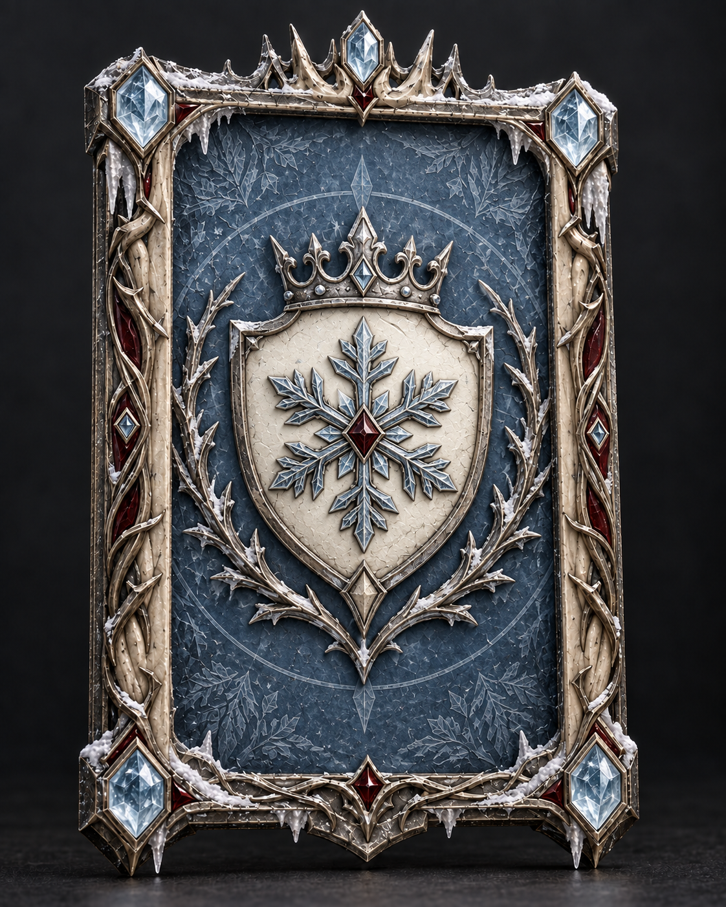
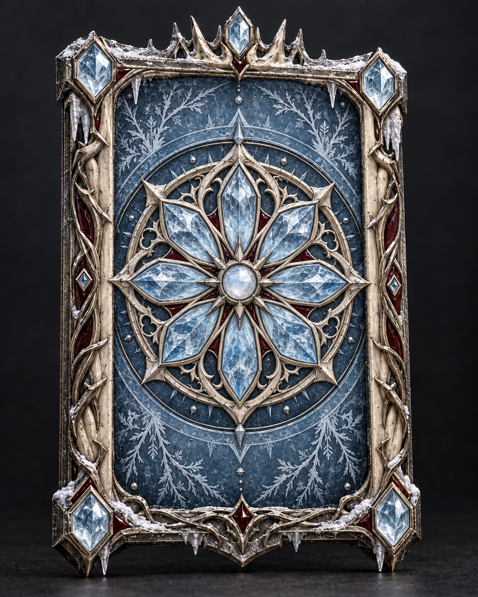
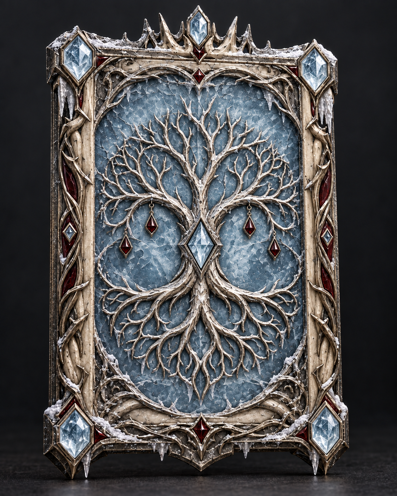
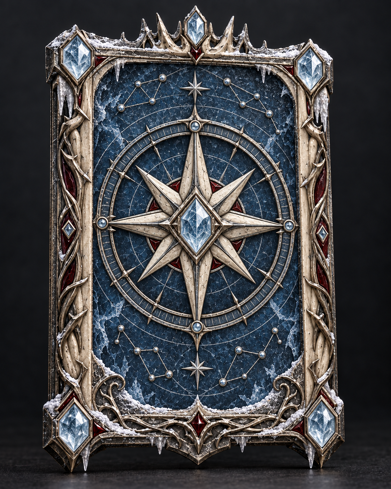
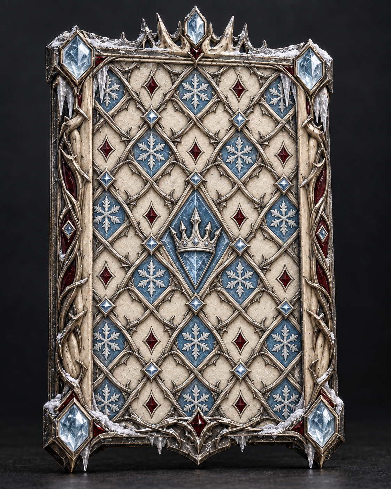

# Winter Crown — five back designs

Generated using the built-in image_gen tool. The user selected Winter Crown as the approved front; reverse selection remains pending. These are concept images, not changes to the interactive app.

Approved front reference: ../02-winter-crown.png

## 01. The Royal Seal

A crowned snowflake crest and carved ivory shield.

### Final generation prompt

Use case: stylized-concept.
Asset type: reverse-side design concept for a premium dimensional fantasy collectible card.
Input image 1 is the APPROVED FRONT DESIGN "Winter Crown", used as the exact physical construction and materials reference. Design the BACK of that SAME card, as if we turned it over. Match its tall rectangular proportions, slightly irregular antiqued silver outer frame, weathered carved ivory/bone inner border, fine entwined thorn branches, ice-blue faceted corner crystal settings, narrow deep burgundy enamel accents, frosted edges, small icicles, and the distinctive top crown finial with its central blue crystal. Maintain the same outline and structural footprint; all five variants need to plausibly pair with this one front.

The reverse should have one uninterrupted interior decorative face within the matching perimeter. Remove the front's penguin portrait, title panel and lore panel entirely from the reverse composition. There is NO penguin or other character portrait on the back. NO text, no lettering, no numbers, no runes that resemble text, no logos, no watermark, no website interface. The rear face has its own meaningful emblem and relief pattern described below, beautifully composed with clear hierarchy and balanced empty space.

Render one card only, full object visible, vertical 4:5 image, near frontal with a very slight 6-degree yaw to reveal thickness and tactile depth. Entire crown, finials, corners and bottom edge inside the canvas with 6% safe margins. Card occupies about 85% of image height. Charcoal studio backdrop and dark stone ground, soft moonlit light, high-end photoreal fantasy prop rendering, exquisitely weathered PBR materials. Cool muted ivory, tarnished silver, steel blue, very restrained burgundy; no dominant warm gold, no neon rainbow, no modern sci-fi. Embedded crystals, shallow sculpture and engraved details should read as buildable geometry, not flat printed graphics. Strong northern medieval dark-fantasy mood. This is a concept selection image, not an implementation diagram.

BACK DESIGN 01 — The Royal Seal: A sober heraldic back. A large raised ivory shield occupies the central third, its gently curved face bearing a delicately forged silver six-armed snowflake under a small northern crown. A single tiny burgundy enamel diamond marks the snowflake center. Two restrained silver thorn branches curve upward around the shield in an open oval wreath. Ground is deeply recessed matte slate-blue leather-like enamel, with barely visible debossed fine frost patterns. Above and below the crest are generous quiet blue spaces. Focal point is the sculptural seal: royal, confident, readable, beautifully restrained.

## 02. The Frozen Rose

An intricate crystalline rosette set into deep blue enamel.

### Final generation prompt

Use case: stylized-concept.
Asset type: reverse-side design concept for a premium dimensional fantasy collectible card.
Input image 1 is the APPROVED FRONT DESIGN "Winter Crown", used as the exact physical construction and materials reference. Design the BACK of that SAME card, as if we turned it over. Match its tall rectangular proportions, slightly irregular antiqued silver outer frame, weathered carved ivory/bone inner border, fine entwined thorn branches, ice-blue faceted corner crystal settings, narrow deep burgundy enamel accents, frosted edges, small icicles, and the distinctive top crown finial with its central blue crystal. Maintain the same outline and structural footprint; all five variants need to plausibly pair with this one front.

The reverse should have one uninterrupted interior decorative face within the matching perimeter. Remove the front's penguin portrait, title panel and lore panel entirely from the reverse composition. There is NO penguin or other character portrait on the back. NO text, no lettering, no numbers, no runes that resemble text, no logos, no watermark, no website interface. The rear face has its own meaningful emblem and relief pattern described below, beautifully composed with clear hierarchy and balanced empty space.

Render one card only, full object visible, vertical 4:5 image, near frontal with a very slight 6-degree yaw to reveal thickness and tactile depth. Entire crown, finials, corners and bottom edge inside the canvas with 6% safe margins. Card occupies about 85% of image height. Charcoal studio backdrop and dark stone ground, soft moonlit light, high-end photoreal fantasy prop rendering, exquisitely weathered PBR materials. Cool muted ivory, tarnished silver, steel blue, very restrained burgundy; no dominant warm gold, no neon rainbow, no modern sci-fi. Embedded crystals, shallow sculpture and engraved details should read as buildable geometry, not flat printed graphics. Strong northern medieval dark-fantasy mood. This is a concept selection image, not an implementation diagram.

BACK DESIGN 02 — The Frozen Rose: A spectacular radial back centered on a large eightfold ice-crystal rose window. It is a circular layered rosette assembled from frosted translucent ice-blue crystal petals, ivory carved tracery, and tarnished silver bezels. Central small milky moonstone; tiny burgundy glass slivers between selected petals. Multiple nested shallow layers create compelling depth and parallax. The rosette fills about two thirds of the interior width, surrounded by an elegant dark steel-blue enamel field with sparse finely etched frost. No cathedral towers or extra silhouette changes. This direction feels magical and jewel-like with strong radial symmetry.

## 03. The Winter Tree

A silver tree whose branches and roots form a mirrored emblem.

### Final generation prompt

Use case: stylized-concept.
Asset type: reverse-side design concept for a premium dimensional fantasy collectible card.
Input image 1 is the APPROVED FRONT DESIGN "Winter Crown", used as the exact physical construction and materials reference. Design the BACK of that SAME card, as if we turned it over. Match its tall rectangular proportions, slightly irregular antiqued silver outer frame, weathered carved ivory/bone inner border, fine entwined thorn branches, ice-blue faceted corner crystal settings, narrow deep burgundy enamel accents, frosted edges, small icicles, and the distinctive top crown finial with its central blue crystal. Maintain the same outline and structural footprint; all five variants need to plausibly pair with this one front.

The reverse should have one uninterrupted interior decorative face within the matching perimeter. Remove the front's penguin portrait, title panel and lore panel entirely from the reverse composition. There is NO penguin or other character portrait on the back. NO text, no lettering, no numbers, no runes that resemble text, no logos, no watermark, no website interface. The rear face has its own meaningful emblem and relief pattern described below, beautifully composed with clear hierarchy and balanced empty space.

Render one card only, full object visible, vertical 4:5 image, near frontal with a very slight 6-degree yaw to reveal thickness and tactile depth. Entire crown, finials, corners and bottom edge inside the canvas with 6% safe margins. Card occupies about 85% of image height. Charcoal studio backdrop and dark stone ground, soft moonlit light, high-end photoreal fantasy prop rendering, exquisitely weathered PBR materials. Cool muted ivory, tarnished silver, steel blue, very restrained burgundy; no dominant warm gold, no neon rainbow, no modern sci-fi. Embedded crystals, shallow sculpture and engraved details should read as buildable geometry, not flat printed graphics. Strong northern medieval dark-fantasy mood. This is a concept selection image, not an implementation diagram.

BACK DESIGN 03 — The Winter Tree: A poetic sculptural reverse featuring one leafless ancient winter tree made from fine raised antiqued silver. Its broad branching canopy arches upward, and its exposed roots below mirror the canopy to form a nearly circular medallion without a hard circular rim. The trunk splits around a single small frost-blue crystal at center. A quiet milk-blue translucent frosted glass field behind the silver tree contains a few subtle hairline ice fractures and internal wisps. Ivory border carving seamlessly echoes roots. Three tiny burgundy teardrop inlays hang among the lower branches. No forest scene, no landscape: one iconic tree emblem, very elegant and tactile.

## 04. The Northern Star

A dimensional polar star inside engraved celestial rings.

### Final generation prompt

Use case: stylized-concept.
Asset type: reverse-side design concept for a premium dimensional fantasy collectible card.
Input image 1 is the APPROVED FRONT DESIGN "Winter Crown", used as the exact physical construction and materials reference. Design the BACK of that SAME card, as if we turned it over. Match its tall rectangular proportions, slightly irregular antiqued silver outer frame, weathered carved ivory/bone inner border, fine entwined thorn branches, ice-blue faceted corner crystal settings, narrow deep burgundy enamel accents, frosted edges, small icicles, and the distinctive top crown finial with its central blue crystal. Maintain the same outline and structural footprint; all five variants need to plausibly pair with this one front.

The reverse should have one uninterrupted interior decorative face within the matching perimeter. Remove the front's penguin portrait, title panel and lore panel entirely from the reverse composition. There is NO penguin or other character portrait on the back. NO text, no lettering, no numbers, no runes that resemble text, no logos, no watermark, no website interface. The rear face has its own meaningful emblem and relief pattern described below, beautifully composed with clear hierarchy and balanced empty space.

Render one card only, full object visible, vertical 4:5 image, near frontal with a very slight 6-degree yaw to reveal thickness and tactile depth. Entire crown, finials, corners and bottom edge inside the canvas with 6% safe margins. Card occupies about 85% of image height. Charcoal studio backdrop and dark stone ground, soft moonlit light, high-end photoreal fantasy prop rendering, exquisitely weathered PBR materials. Cool muted ivory, tarnished silver, steel blue, very restrained burgundy; no dominant warm gold, no neon rainbow, no modern sci-fi. Embedded crystals, shallow sculpture and engraved details should read as buildable geometry, not flat printed graphics. Strong northern medieval dark-fantasy mood. This is a concept selection image, not an implementation diagram.

BACK DESIGN 04 — The Northern Star: An ancient northern celestial instrument translated into the card's reverse. A raised eight-point compass star of carved ivory and antiqued silver sits in the center; its long vertical points are dominant. Center holds one faceted glacial-blue gemstone. Around it, two slim dimensional silver astrolabe rings with fine tick engravings and tiny embedded crystal pins float just above a deeply inset midnight-blue enamel disc. Small constellation points made from silver pins occupy the upper and lower negative space, no text or runes. A few narrow burgundy enamel arcs subtly connect the design to the front. Dignified, astronomical, mysterious, readable at a small size; no mechanical gears or technology.

## 05. The Frostbound Lattice

An ivory-and-silver woven pattern with a small central crown.

### Final generation prompt

Use case: stylized-concept.
Asset type: reverse-side design concept for a premium dimensional fantasy collectible card.
Input image 1 is the APPROVED FRONT DESIGN "Winter Crown", used as the exact physical construction and materials reference. Design the BACK of that SAME card, as if we turned it over. Match its tall rectangular proportions, slightly irregular antiqued silver outer frame, weathered carved ivory/bone inner border, fine entwined thorn branches, ice-blue faceted corner crystal settings, narrow deep burgundy enamel accents, frosted edges, small icicles, and the distinctive top crown finial with its central blue crystal. Maintain the same outline and structural footprint; all five variants need to plausibly pair with this one front.

The reverse should have one uninterrupted interior decorative face within the matching perimeter. Remove the front's penguin portrait, title panel and lore panel entirely from the reverse composition. There is NO penguin or other character portrait on the back. NO text, no lettering, no numbers, no runes that resemble text, no logos, no watermark, no website interface. The rear face has its own meaningful emblem and relief pattern described below, beautifully composed with clear hierarchy and balanced empty space.

Render one card only, full object visible, vertical 4:5 image, near frontal with a very slight 6-degree yaw to reveal thickness and tactile depth. Entire crown, finials, corners and bottom edge inside the canvas with 6% safe margins. Card occupies about 85% of image height. Charcoal studio backdrop and dark stone ground, soft moonlit light, high-end photoreal fantasy prop rendering, exquisitely weathered PBR materials. Cool muted ivory, tarnished silver, steel blue, very restrained burgundy; no dominant warm gold, no neon rainbow, no modern sci-fi. Embedded crystals, shallow sculpture and engraved details should read as buildable geometry, not flat printed graphics. Strong northern medieval dark-fantasy mood. This is a concept selection image, not an implementation diagram.

BACK DESIGN 05 — The Frostbound Lattice: A true ornate playing-card back with a repeating textile-like surface rather than one large medallion. Fine raised silver thorn ribbons interweave across a softly weathered ivory field to create a symmetrical diagonal diamond lattice. Alternating small diamond cells contain shallow ice-blue enamel snowflakes and tiny burgundy lozenges. Near the exact center, one modest carved silver crown on a single elongated blue crystal diamond interrupts the pattern, only about one fifth the face width. Dense craftsmanship balanced with an understated central emblem; crisp elegant symmetry, visible ivory material between the woven lines. The texture appears carved, inlaid and embossed rather than printed. More decorative, paler, and more evenly patterned than the other four backs.
